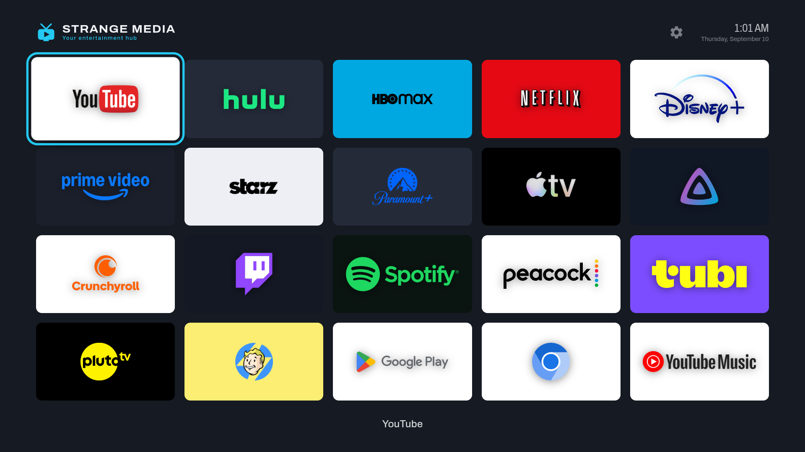
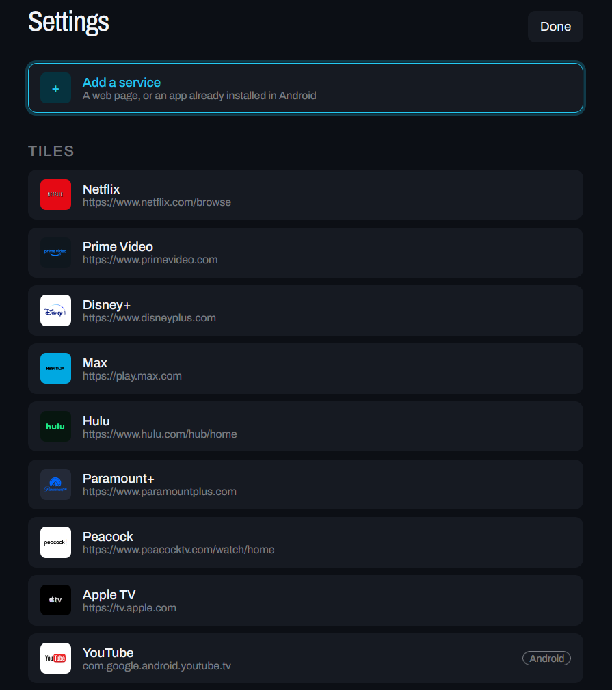
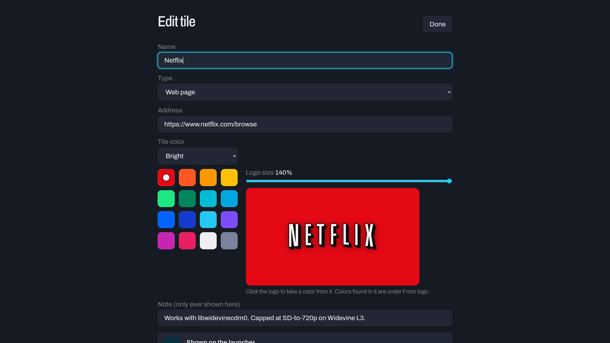
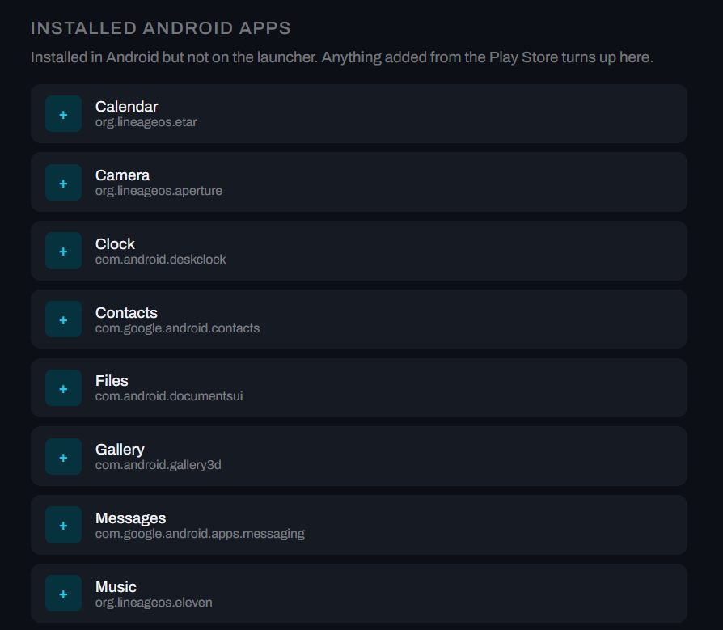

# Strange Media

A launcher that turns a Raspberry Pi into a TV streaming box.



## What it is

Every service you use on one screen, driven from a remote. Pick one and the service
opens full screen with no browser furniture around it, so it behaves like an
app rather than a web page you happen to be looking at on a television.

Most streaming services have no Raspberry Pi app. They do all have web
players, and a Pi 5 can run them. This wraps those players in something you
can operate from a sofa: one Chromium kiosk window per service, each with its
own profile and its own login, launched from a grid you can rearrange by
holding the OK button.

Android apps work as well, through Waydroid. Anything installed from the Play
Store appears in settings ready to become a tile, which is how YouTube and
YouTube Music run here as real Android TV apps with proper remote navigation.

That route stops at anything with DRM. Waydroid ships no Widevine, so Netflix
and the other subscription services run as web players in Chromium, which
does have it.

## Why it exists

The Pi is a capable little media machine with nothing on it that behaves like
a TV interface. Plug one into a television and you get a desktop, a mouse
pointer and a browser, which is a poor way to start watching something from
eight feet away.

A Roku or a Fire Stick solves it, and charges you for the fix in home screen
real estate. Rows you did not ask for, and adverts between you and the thing
you sat down to watch.

So this is the other trade. The catalog is a JSON file you own. Nothing
phones home, nothing recommends anything, and the only things on the screen
are the services you put there.

Owning it includes being able to take it with you. Settings will hand you the
whole thing as a single file, tiles and colors and artwork and the order you
arranged them in, and put it back on another Pi. Your logins do not travel,
so a restored box asks you to sign in once per service, but everything you
spent an evening arranging does.

## Screenshots

Settings lists every tile, the Android apps that could become tiles, and the
way back to the Pi desktop.



Editing a tile shows it drawn exactly as the launcher draws it, at the same
proportions and with the same logo treatment, so the color you pick is the
color you get.



Install something from the Play Store and it turns up here with its package
name filled in, one press away from being a tile.



## When nobody is watching

The backdrop behind the tiles is the day's Bing wallpaper, blurred back far
enough that the logos stay readable, replaced every hour.

Leave the launcher alone for ten minutes and those pictures fill the screen
with a clock over them, crossfading every forty-five seconds. Leave it another
half hour and the panel powers down, because by then the room is empty and a
lit television is just electricity and burn-in. Any button on the remote brings
it straight back.

None of that can happen while you are watching something. The launcher asks
whether a service is open before it starts, so a long film never trips it.

## It looks after itself

Boot a Raspberry Pi while the television is switched off and the sound never
arrives. PipeWire asks each HDMI port what it can do exactly once, as it
starts, and a sleeping TV cannot answer, so it concludes there is no sound card
and routes everything into a null output that accepts audio and discards it.
Turning the TV on afterwards changes nothing, because the question is not asked
twice.

Waydroid has a separate trick, where the Android session reports itself
perfectly healthy, accepts every request to open an app, and opens nothing.

Both used to need somebody who knew which service to restart. A health check
now finds the audio one within a minute of the TV waking, and the launcher
restarts the Android session itself when an app fails to open. The details, and
the several things that mislead you while diagnosing either, are in the
technical notes.

## What it is built on

Python 3 from the standard library, and nothing else. `launcher.py` is a
single file running `http.server`, with no packages to install and no
virtualenv.

Chromium provides the players, one kiosk window per service, with Widevine
through the `libwidevinecdm0` package for the services that need DRM.

[labwc](https://labwc.github.io/) is the Wayland compositor Raspberry Pi OS
ships, and it handles the hotkeys a kiosk window would otherwise swallow.
[Waydroid](https://waydro.id/) runs the Android side. systemd user units
start the daemon and the display shell at login.

There is no framework and no build step. Editing `index.html` and reloading
the page is the entire development loop.

## Getting it running on a new Pi

You need a Raspberry Pi 5 running 64-bit Raspberry Pi OS with the desktop,
which is the release that uses labwc. A keyboard is needed for setup; after
that any remote sending arrow keys and Enter will do, including most HDMI-CEC
TV remotes and air mice. Bring your own accounts for the services, since this
launches their players and provides no content of its own.

```bash
git clone https://github.com/dirkstrange/pilauncher.git ~/pilauncher
cd ~/pilauncher
./install.sh
```

`install.sh` installs the packages, writes the systemd user units, adds the
compositor keybinds, installs the remote's key mapping, enables the health
check and starts everything. It is safe to re-run, which is also how you apply
changes after a `git pull`:

```bash
cd ~/pilauncher && git pull --ff-only && ./install.sh
```

Reboot and the launcher comes up on its own. Before trusting the streaming
tiles, open <https://bitmovin.com/demos/drm> on the Pi and confirm the stream
plays, which is what tells you Widevine is working. Then press the gear in
the corner and start adding your own services.

### Moving an existing setup to a new Pi

If you already have one running, you do not have to build the grid twice. On
the old machine, Settings has "Save a backup", which hands you a single file
holding every tile, its colors, its logo and the order they sit in. Copy that
file onto the new Pi anywhere you can reach with a file picker, then after
`install.sh` use "Restore from a backup".

The one thing that does not travel is your logins, which live in the browser
profiles rather than in the catalog. A restored box looks exactly like the old
one and asks you to sign in once per service.

## Things worth knowing before you build one

Netflix caps at about 720p here and Apple TV barely works. Both are decisions
those services make about Widevine on Linux, and neither is fixable from this
end. Protected content will not play at all under Waydroid, which has no
Widevine of its own. If any of that matters to you, read "Known ceilings" in
the technical notes before spending an evening on this.

## License

GPLv3. The full text is in [LICENSE](LICENSE). Fork it, change it, run it on
whatever you like. The one condition is that if you distribute a modified
version, that version has to be free software under the same terms, so
improvements stay available to everyone who receives them.

The Strange Media name and the marks in [design/](design/) are not covered.
They identify this project rather than being part of it, so a fork wants its
own name on it.

## Trademarks

Netflix, Prime Video, Disney+, Max, Hulu, Paramount+, Peacock, Apple TV,
Crunchyroll, Twitch, Spotify, Tubi, Pluto TV, Starz, YouTube and the Play
Store are trademarks of their respective owners. This project is not
affiliated with, endorsed by, or connected to any of them.

No service artwork is distributed here. The `.gitignore` deliberately
excludes image files so a logo cannot be committed by accident, and
[scripts/fetch_logos.py](scripts/fetch_logos.py) pulls each one onto your own
machine at install time instead. The screenshots on this page show those
logos as they appear on screen, which is what a screenshot of a working
launcher looks like.

## The details

[docs/TECHNICAL.md](docs/TECHNICAL.md) has everything this page leaves out.
How Widevine actually resolves, and why checking `/opt/WidevineCdm` tells you
nothing. Why the remote's OK button arrives dead and has to be remapped in
evdev. What the compositor does with a kiosk window's keystrokes. How the
catalog gets written without ever losing it, and where it lives.

Also what a boot with the television switched off quietly breaks, which is more
than it sounds and none of which looks like a display problem: silence that
survives turning the TV on, Android windows drawn at the wrong size in the
middle of the screen, and a perfectly healthy sound card that fails the obvious
test command. Plus the screensaver, the Android session, and the ceilings
mentioned above.

`design/` holds the brand kit: the marks, the palette, and the sheet they are
documented on. Both pages inline those marks rather than fetching them, so
that folder is a source of truth rather than a runtime dependency.
